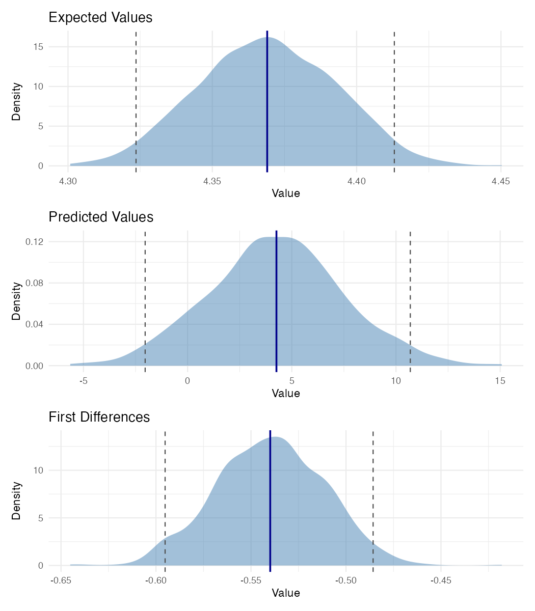
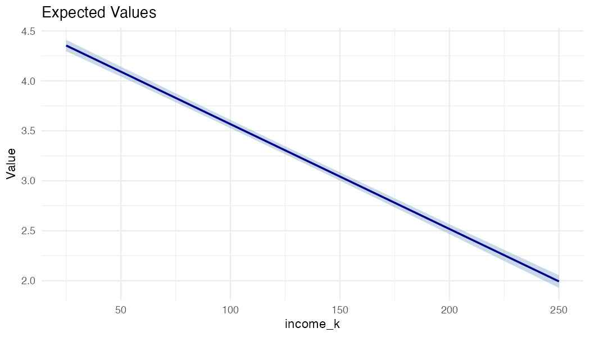
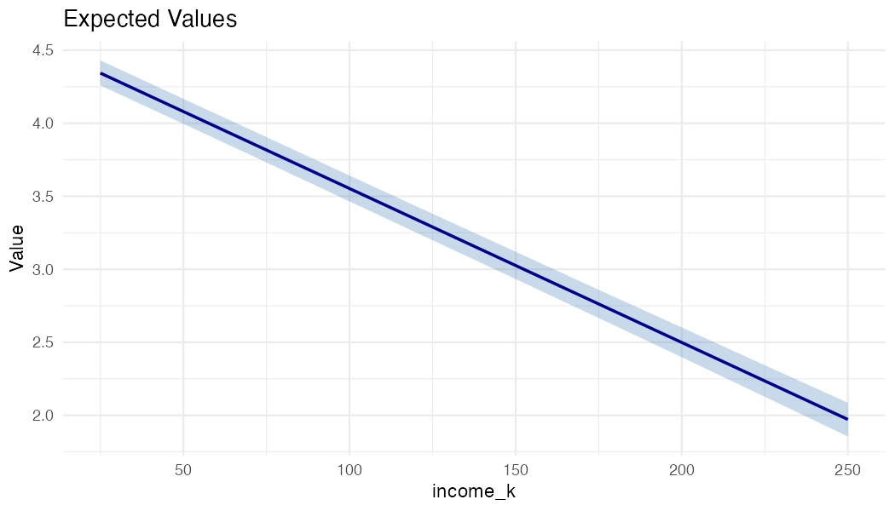
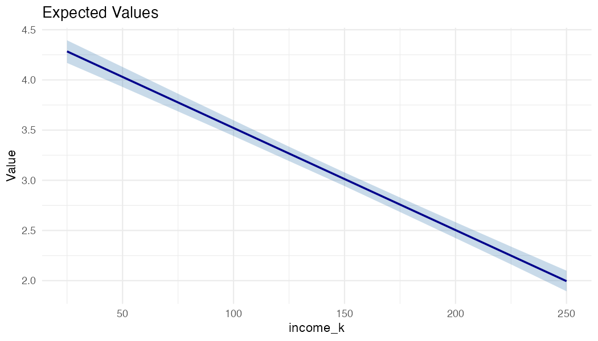

# Comparison with the Original Zelig

## Background

`zelig2` is a reimplementation of the original [Zelig](https://github.com/IQSS/Zelig) R package developed at Harvard's Institute for Quantitative Social Science (King, Tomz, and Wittenberg 2000; Imai, King, and Lau 2007, 2008). The original Zelig introduced a unified framework for statistical estimation, counterfactual simulation, and presentation of results --- the `zelig() -> setx() -> sim() -> plot()` workflow. `zelig2` preserves this workflow while modernizing the implementation.

This page demonstrates two things:

1. **Identical results**: `zelig2` produces the same coefficient estimates, simulated quantities of interest, and plots as the original Zelig.
2. **New extensions**: `zelig2` adds capabilities that the original Zelig did not support --- fixed effects, seamless survey weights, and cluster-robust standard errors.

All examples use data from the U.S. Census Bureau's **Household Pulse Survey** (Week 62, N = 58,202).

---

## Part A: Identical Results

### Coefficients

Both packages use `glm()` as the underlying estimation engine, so point estimates and standard errors are identical:

=== "Zelig"

    ```r
    library(Zelig)
    z <- zelig(mh_score ~ age + college + income_k,
               model = "ls", data = pulse)
    summary(z)
    ```

    ```
    Coefficients:
                  Estimate Std. Error t value Pr(>|t|)
    (Intercept)  7.4623284  0.0524801  142.19   <2e-16
    age         -0.0576614  0.0008495  -67.87   <2e-16
    college     -0.5399261  0.0291606  -18.52   <2e-16
    income_k    -0.0104966  0.0001997  -52.56   <2e-16
    ```

=== "zelig2"

    ```r
    library(zelig2)
    z <- zelig2(mh_score ~ age + college + income_k,
                model = "ls", data = pulse, num = 1000L)
    summary(z)
    ```

    ```
    Coefficients:
                   Estimate  Std. Error z value  Pr(>|z|)
    (Intercept)  7.46232840  0.05248010 142.194 < 2.2e-16 ***
    age         -0.05766141  0.00084954 -67.874 < 2.2e-16 ***
    college     -0.53992615  0.02916059 -18.516 < 2.2e-16 ***
    income_k    -0.01049659  0.00019970 -52.562 < 2.2e-16 ***
    ```

| Variable | Zelig | `zelig2` |
|---|---|---|
| (Intercept) | 7.46232840 | 7.46232840 |
| age | -0.05766141 | -0.05766141 |
| college | -0.53992615 | -0.53992615 |
| income_k | -0.01049659 | -0.01049659 |


### Point Scenario Plots

Both packages implement the King, Tomz, and Wittenberg (2000) simulation approach: draw $\tilde{\beta}$ from $N(\hat{\beta}, \hat{V})$, then compute quantities of interest at specified covariate values. Here we set a point scenario (40-year-old college graduate, $75k income) and plot:

=== "Zelig"

    ```r
    z <- setx(z, age = 40, college = 1, income_k = 75)
    z <- sim(z)
    plot(z)
    ```

    

    The expected value density (bottom panel) is centered at **3.83** with 95% CI [3.78, 3.87].

=== "zelig2"

    ```r
    z <- setx(z, age = 40, college = 1, income_k = 75)
    z <- sim(z)
    plot(z)
    ```

    

    The expected value density (top panel) is centered at **3.83** with 95% CI [3.78, 3.87].

The density shapes, centers, and spreads are the same. The visual difference is styling: Zelig uses base R graphics (red fill), while `zelig2` uses `ggplot2` (blue fill with mean and CI lines).

### First Difference Plots

First differences --- the change in expected value when one covariate changes --- are the central quantity in the Zelig framework. Here we compare college graduates to non-graduates:

=== "Zelig"

    ```r
    z <- zelig(mh_score ~ age + college + income_k,
               model = "ls", data = pulse)
    z <- setx(z, age = 40, college = 0, income_k = 75)
    z <- setx1(z, age = 40, college = 1, income_k = 75)
    z <- sim(z)
    plot(z)
    ```

    

    The first difference density (center panel) is centered at **-0.54** with 95% CI [-0.60, -0.48]. The bottom panels show the overlaid distributions for each scenario.

=== "zelig2"

    ```r
    z <- zelig2(mh_score ~ age + college + income_k,
                model = "ls", data = pulse, num = 1000L)
    z <- setx(z, age = 40, college = 0, income_k = 75)
    z <- setx1(z, age = 40, college = 1, income_k = 75)
    z <- sim(z)
    plot(z)
    ```

    

    The first difference density (bottom panel) is centered at **-0.54** with 95% CI [-0.60, -0.49].

Both packages estimate the same first difference: a college degree is associated with a **0.54-point reduction** in mental health symptom scores.

### Range Scenario Plot

`zelig2` extends the `setx()` interface with range scenarios --- pass a vector to visualize how expected values change across a continuous predictor:

```r
z <- zelig2(mh_score ~ age + college + income_k,
            model = "ls", data = pulse, num = 1000L)
z <- setx(z, age = 40, college = 1,
          income_k = seq(25, 250, by = 25))
z <- sim(z)
plot(z)
```



Expected symptom scores decline from 4.35 to 1.99 as household income increases from $25,000 to $250,000. The ribbon represents the 95% confidence band from 1,000 simulated draws.

---

## Part B: Extensions Beyond the Original Zelig

### 1. Fixed Effects

The original Zelig did not support fixed effects. `zelig2` integrates the `fixest` package (Berge 2018), allowing fixed effects via `|` in the formula:

```r
z_fe <- zelig2(mh_score ~ age + college + income_k | state_fct,
               model = "ls", data = pulse, num = 1000L)
summary(z_fe)
```

```
zelig2:  Least Squares (Linear Regression)
Formula:  mh_score ~ age + college + income_k
Full formula:  mh_score ~ age + college + income_k | state_fct
N:  58202
Fixed effects:  state_fct

Coefficients:
            Estimate  Std. Error z value  Pr(>|z|)
age      -0.05798140  0.00085191 -68.061 < 2.2e-16 ***
college  -0.53324388  0.02922396 -18.247 < 2.2e-16 ***
income_k -0.01054457  0.00020256 -52.056 < 2.2e-16 ***
```

The 51 state fixed effects absorb all time-invariant state-level confounders. The `setx() -> sim() -> plot()` workflow works identically:

```r
z_fe <- setx(z_fe, age = 40, college = 1,
             income_k = seq(25, 250, by = 25))
z_fe <- sim(z_fe)
plot(z_fe)
```



The wider confidence band (compared to Part A) reflects the additional uncertainty from averaging over state-level intercepts.

### 2. Survey Weights

The original Zelig required separate model types for survey-weighted estimation (e.g., `model = "ls.survey"` instead of `model = "ls"`). In `zelig2`, pass the weight vector directly --- no model type change needed:

```r
z_svy <- zelig2(mh_score ~ age + college + income_k,
                model = "ls", data = pulse,
                weights = pulse$pweight, num = 1000L)
```

```
Coefficients:
               Estimate  Std. Error  z value  Pr(>|z|)
(Intercept)  7.08844445  0.12424980  57.0499 < 2.2e-16 ***
age         -0.05369919  0.00194374 -27.6267 < 2.2e-16 ***
college     -0.40248340  0.05548744  -7.2536 4.059e-13 ***
income_k    -0.01016999  0.00038834 -26.1883 < 2.2e-16 ***
```

Survey weighting substantially changes the estimates --- the college effect shrinks from -0.540 to -0.402 (a 26% reduction), and standard errors approximately double to reflect the survey design.

```r
z_svy <- setx(z_svy, age = 40, college = 1,
              income_k = seq(25, 250, by = 25))
z_svy <- sim(z_svy)
plot(z_svy)
```



### 3. Cluster-Robust Standard Errors

The original Zelig did not support robust or clustered standard errors. `zelig2` provides HC0--HC4, cluster-robust, and bootstrap SEs via `vcov_type`:

```r
z_cluster <- zelig2(mh_score ~ age + college + income_k | state_fct,
                    model = "ls", data = pulse,
                    vcov_type = "cluster", cluster = ~state_fct)
summary(z_cluster)
```

```
Coefficients:
            Estimate  Std. Error z value  Pr(>|z|)
age      -0.05798140  0.00118716 -48.840 < 2.2e-16 ***
college  -0.53324388  0.03369631 -15.825 < 2.2e-16 ***
income_k -0.01054457  0.00026454 -39.861 < 2.2e-16 ***
```

Clustering at the state level increases standard errors by 15--40%:

| Variable | Default SE | Cluster SE | Ratio |
|---|---|---|---|
| age | 0.00085 | 0.00119 | 1.40x |
| college | 0.02922 | 0.03370 | 1.15x |
| income_k | 0.00020 | 0.00026 | 1.31x |

---

## Summary

| Feature | Original Zelig | `zelig2` |
|---|---|---|
| Point estimates | Via `glm()` | Via `glm()` (identical) |
| `setx() -> sim() -> plot()` | Yes | Yes (same results) |
| Fixed effects | Not supported | `y ~ x \| fe` via `fixest` |
| Survey weights | Separate model types (`"ls.survey"`, `"logit.survey"`) | `weights = ...` on any model |
| Robust / clustered SEs | Not supported | `vcov_type = "HC1"`, `"cluster"`, `"bootstrap"` |
| Plotting | Base R | `ggplot2` + `patchwork` |
| Dependencies | 16 packages | 7 packages |
| Last updated | 2020 (incompatible with modern R) | Active development |

## References

- **King, G., Tomz, M., and Wittenberg, J.** (2000). "Making the Most of Statistical Analyses: Improving Interpretation and Presentation." *American Journal of Political Science*, 44(2), 347--361.
- **Imai, K., King, G., and Lau, O.** (2007). "Zelig: Everyone's Statistical Software." R package.
- **Imai, K., King, G., and Lau, O.** (2008). "Toward a Common Framework for Statistical Analysis and Development." *Journal of Computational and Graphical Statistics*, 17(4), 892--913.
- **Berge, L.** (2018). "Efficient Estimation of Maximum Likelihood Models with Multiple Fixed-Effects: the R Package fixest." CREA Discussion Paper.
